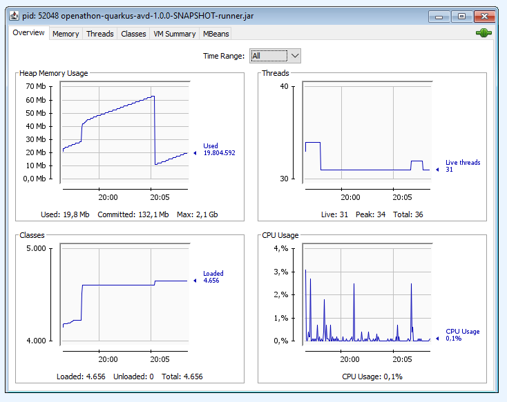

<p align="center">
    
</p>

# Openathon VIII QUARKUS - Nuestra aplicación "Hola Openathon!"

## Creando un proyecto Quarkus

¡¡Vamos a crear nuestro proyecto!!, se tratará de un simple [endpoint](https://en.wikipedia.org/wiki/Endpoint_interface) de bienvenida para nuestros visitantes. Hacerlo es muy sencillo y para hacerlo utilizaremos Maven y el [plugin](https://quarkus.io/guides/maven-tooling) del que dispone el propio quarkus (quarkus-maven-plugin) para crear su estructura básica.

Los pasos son muy sencillos:

- Abrimos una consola de comando y nos dirigimos al directorio donde vayamos a desarrollar nuestros laboratorios. Una vez allí ejecutamos:

Windows
```console
mvn io.quarkus:quarkus-maven-plugin:1.11.3.Final:create -DprojectGroupId=acctnr.openathon -DprojectArtifactId=openathon-quarkus -DclassName="acctnr.openathon.started.GreetingResource" -Dpath="/helloOpenathon"
```

Linux
```console
mvn io.quarkus:quarkus-maven-plugin:1.11.3.Final:create \
-DprojectGroupId=acctnr.openathon \
-DprojectArtifactId=openathon-quarkus \
-DclassName="acctnr.openathon.started.GreetingResource" \
-Dpath="/helloOpenathon"
```

Vamos a descomponer la instrucción para entenderla

| Instrucción | Significado |
| ------------- | ------------- |
| mvn  | Invocación a [maven](https://maven.apache.org/what-is-maven.html)|
| io.quarkus:quarkus-maven-plugin:1.11.3.Final:create  | Indica a maven la ejecución de la instrucción “create” del plugin de quarkus  |
| projectGroupId  | El [groupId](https://maven.apache.org/guides/mini/guide-naming-conventions.html) del proyecto. |
| projectArtifactId  | El [projectArtifactId](https://maven.apache.org/guides/mini/guide-naming-conventions.html) del proyecto.  |
| className  | El clase que implementará el endpoint |
| path  | El path de acceso al endpoint  |

Adicionalmente podríamos también introducir el argumento “extensions” para especificar la lista de extensión a añadir al proyecto. Inicialmente no vamos a utilizar ninguna, pero si ejecutamos:
```console
mvnw quarkus:list-extensions
```
Obtendremos la lista de 366 extensiones que actualmente están disponibles.

Existe también la posibilidad de utilizar https://code.quarkus.io/ para generar una aplicación seleccionado de manera visual las extensiones que queremos utilizar.

- Si todo va bien (y debería!:innocent:) obtendremos un mensaje BUILD SUCCESS y nuestro proyecto se habrá creado dentro de una nueva carpeta “openathon-quarkus”. 

Vamos a comprobar que se encuentra dentro del proyecto:

  - La estructura estándar de un proyecto [maven](https://maven.apache.org/guides/getting-started/index.html).
  - El fichero pom.xml, el fichero mvnw y el directorio wrapper.
  - La clase GreetingResource.java que implementa el endpoint /helloOpenathon.
  - El Unit Test de la clase GreetingResoource.
  - Una página de inicio “resources\META-INF\resources\index.html” accesible en http://localhost:8080
  - Las Dockerfiles, para su ejecución en un entorno Docker. Podemos comprobar que ha creado tres ficheros:
    - Dockerfile.fast-jar y Dockerfile.jvm. Estos ficheros son utilizados para crear un contenedor que ejecuta la aplicación dentro del contenedor JVM.
    - Dockerfile.native. Este dockerfile es usado para construir un contenedor que ejecuta la aplicación en modo nativo (no JVM).
	La diferencia entre las dos primeras es:
	```sh
    # We make four distinct layers so if there are application changes the library layers can be re-used
    COPY --chown=1001 target/quarkus-app/lib/ /deployments/lib/
    COPY --chown=1001 target/quarkus-app/*.jar /deployments/
    COPY --chown=1001 target/quarkus-app/app/ /deployments/app/
    COPY --chown=1001 target/quarkus-app/quarkus/ /deployments/quarkus/
    ```
	Este dockerfile “fast” es un nuevo formato (a partir de Quarkus 1.5) de containerización que quiere conseguir mejoras de rendimiento y que en el futuro se debería convertir en el estándar. 
  - Los ficheros de configuración y propiedades de la aplicación.

- Podemos ahora abrir el proyecto con nuestro IDE favorito. Nosotros utilizar Visual Studio Code, pero podéis utilizar el que queráis o incluso directamente el notepad.

- Vamos a revisar en el pom.xml, que contiene información sobre el proyecto, sus dependencias, fuentes, test, plugins, etc, las dos dependencias directas que se han añadido respecto a Quarkus:
  - quarkus-maven-plugin. Responsable del empaquetado de la aplicación y de la creación de un entorno completo de desarrollo que nos permitirá probar nuestra aplicación y realizar cambios en caliente.
  - quarkus-arc. Encargado de la inyección de dependencias, basado en CDI.
  - quarkus-resteasy. Extensión para el desarrollo de servicios REST.
  - quarkus-junit5. Requerido para la implementación de pruebas, provee de la anotación @QuarkusTest que controla el framework de testing.
  - rest-assured. Para la prueba de endpoints.

- El plugin maven que hemos usado, quarkus-maven-plugin, ha creado también una clase GreetingResource (en src\main\java\acctnr\openathon\started) para el endpoint [JAX-RX](https://es.wikipedia.org/wiki/JAX-RS) “/helloOpenathon”.

```java
@Path("/helloOpenathon")
public class GreetingResource {

    @GET
    @Produces(MediaType.TEXT_PLAIN)
    public String hello() {
        return "Hello RESTEasy";
    }
}
```

… y la test unit (en scr\test\java\acctnr\openathon\started) necesaria para comprobar su funcionamiento:

```java
@QuarkusTest
public class GreetingResourceTest {
    @Test
    public void testHelloEndpoint() {
        given()
          .when().get("/helloOpenathon")
          .then()
             .statusCode(200)
             .body(is("Hello RESTEasy"));
    }
}
```

## Ejecutando el proyecto en su entorno de desarrollo

Entre los principios de Quarkus está la velocidad (**SUPERSONIC!**:grin:), sin más podemos ya probar la aplicación. Quarkus provee para ello de un entorno de desarrollo integrado preparado para ser ejecutado de manera inmediata tras crear el proyecto.

- Posicionamos una consola de comando en el directorio del proyecto, donde están los archivos pom.xml y mvnw y ejecutamos:

```console
mvnw compile quarkus:dev:
```
*Si estamos utilizando Visual Studio Code, podemos abrir uno o más consolas directamente en la aplicación y lanzarlo directamente.*

En el resultado veremos el mensaje sobre el arranque del entorno de desarrollo de Quarkus:

```console
(Quarkus Main Thread) getting-started 1.0.0-SNAPSHOT on JVM (powered by Quarkus 1.11.3.Final) started in 2.318s. Listening on: http://localhost:8080
```

- Podemos ahora comprobar que la aplicación está levantada correctamente de dos maneras:
  1. Accediendo a http://localhost:8080/helloOpenathon en un navegador, obteniendo como respuesta “Hello RESTeasy”.
  2. Desde consola podemos también ejecutar
  ```console
   curl -w "\n" http://localhost:8080/helloOpenathon
  ```
  obteniendo la misma respuesta.
  
- \[Optional\] Vamos ahora a comprobar el funcionamiento del despliegue automático de los cambios. Vamos a modificar la respuesta del servicio para que responda de una manera más personalizada para nuestro Openathon. Dentro del proyecto, modificamos en main\acctnr\openathon\started\GreetingResource el mensaje de retorno de la función:

```java
@Path("/helloOpenathon")
public class GreetingResource {

    @GET
    @Produces(MediaType.TEXT_PLAIN)
    public String hello() {
        return "Hello Openathon";
    }
}
```

Un vez hecho, si volvemos a invocar a http://localhost:8080/helloOpenathon, la respuesta se debe corresponder con el cambio que hayamos hecho.

## Ejecutando los Test Unit

Como indicamos, el proyecto creado con el plugin de Quarkus, contiene por defecto un test unit para la ejecución de las pruebas.

- Se pueden ejecutar este test invocando en consola:

```console
mvnw test
```
Y deberemos obtener un resultado con éxito que incluirá:

```console
[INFO] Results:
[INFO]
[INFO] Tests run: 1, Failures: 0, Errors: 0, Skipped: 0
```

- Si lo hacemos después de haber modificado la respuesta de GreetingResource a “Hello Openathon”, obtendremos un resultado distinto:

```console
[ERROR] acctnr.openathon.started.GreetingResourceTest.testHelloEndpoint  Time elapsed: 1.349 s  <<< FAILURE!
java.lang.AssertionError: 
1 expectation failed.
Response body doesn't match expectation.
Expected: is "Hello RESTEasy"
  Actual: Hello Openathon
```
:question:¿Se os ocurre que ha pasado? y ¿Qué podemos hacer para arreglarlo?.

## Empaquetando la aplicación

Vamos a empaquetar y ejecutar la aplicación directamente en la JVM, sin utilizar el entorno de desarrollo que nos provee Qaurkus.

- La aplicación se empaqueta ejecutando.
```console
mvnw package
``` 
Que debe producir dos resultados distintos dentro del directorio target de nuestro proyecto:
  - *getting-started-quarkus-1.0.0-SNAPSHOT*.  Que contiene las clases y recursos del proyecto. 
  - *getting-started-quarkus-1.0.0-SNAPSHOT-runner.jar*. Un jar autoejecutable con la aplicación.

- Podríamos ahora ejecutar nuestra aplicación dentro de la JVM de nuestra máquina:
```console
java -jar target/openathon-quarkus-1.0.0-SNAPSHOT-runner.jar
```

- Y ejecutarla de la manera habitual:
```console
curl -w "\n" http://localhost:8080/helloOpenathon
```  

## Monitorizando la aplicación en la JVM
Podemos consultar en los logs el tiempo de arranque de la aplicación. Podemos también monitorizar el consumo de recursos utilizando la [Java Monitoring and Management Console](https://docs.oracle.com/javase/8/docs/technotes/guides/management/).

En nuestro caso el análisis de la JVM resulta en:


De lo que podemos extraer
  - Arranque: unos 3 segundos.
  - El consumo de memoria arranca en torno a las 20 megas, que escala hasta las 60 en continuas ejecuciones y desciende a 10 en el momento de entrar el Garbage Collector.
  - Carga en torno a las 4500 clases.
  - Consume en arranque en torno al 3% del procesador y en torno al 0,1% en ejecución.
  
Quedemonos con esos datos, serán relevantes cuando comparemos con Spring Boot.


## Actividad extra. Spring Web

Más adelante en el Openathon utilizaremos Spring Web para crear los servicios Rest en Spring Boot. ¿Te animas a crear un nuevo proyecto y añadir la dependencia con Spring Web…?, ¿Qué efectos tendrá en los consumos de memoria…?
 
Una pista: 
```console
-Dextensions=”quarkus-spring-web”
```

Acuértate que cambiarle el nombre al proyecto (DprojectArtifactId) que nos conocemos… :smiling_imp:

[<Lab 00](../lab-00) | [Lab 02>](../lab-02) 

<p align="center">
    
</p>