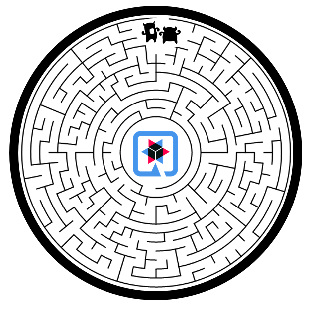

<p align="center">
    
</p>

# Openathon VIII QUARKUS - Creando una imagen nativa

## Introducción

Vamos a introducir ahora un nuevo actor: GraalVM. 

[GraalVM](https://www.graalvm.org/why-graalvm/) es un runtime de alto rendimiento que proporciona importantes mejoras en el rendimiento y consumo de recursos de las aplicaciones. Esta característica es ideal para arquitecturas basadas en microservicios. Una de las características en las que se basa para logarlo es el uso de imágenes nativas.

[Native image](https://www.graalvm.org/reference-manual/native-image/) es una tecnología para realizar una compilación especial “adelantada” que resulta en un ejecutable standalone llamado “native image”. Este ejecutable incluye todo lo necesario como las clases de la aplicación, sus dependencias, las clases necesarias del runtime y el código nativo de la JVM. El resultado no se ejecuta en la máquina virtual java, sino directamente como un proceso nativo. El resultado es un tiempo de ejecución y unos consumos de memoria muy reducidos respecto al uso de la máquina virtual.

Así, utilizando GraalVM y Quarkus podemos crear aplicaciones java que pueden ser compiladas como ejecutables standalone nativos. Estos ejecutables nativos con pequeñas aplicaciones java que contienen todos los recursos necesarios para su ejecución no requieren de una máquina virtual para ejecutarse, ya que contienen todo lo necesario para ejecutarse de manera nativa en un determinado sistema operativo. Esto supone una dramática mejora en el consumo de recursos, los tiempos de respuesta y en general el rendimiento de la aplicación.

Así que el objetivo de nuestro laboratorio será crear una imagen nativa de nuestra aplicación para instalarla en un contenedor docker y comprobar el uso de recursos. Para poder crear esta imagen nativa lógicamente necesitaremos usar una distribución de GraalVM, tendríamos tres posibilidades Oracle GraalVM Community Edition (CE), Oracle GraalVM Enterprise Edition (EE) and Mandrel. Las dos primeras exigen la instalación de GraalVM en nuestras máquinas, lo que puede suponer algún problema, por lo que vamos a optar por utilizar Mandrel, que además es la opción específica para Quarkus.

Mandrel deriva de la GraalVM Community Edition y su objetivo es proporcionar una forma de construir imágenes nativas específicamente diseñadas para ejecutar Quarkus. Incorpora respecto a la distribución origen exclusiones que no son necesarias para la ejecución de Quarkus, reduciendo con ello de forma significativa el tamaño de la distribución. Como contrapartida, se pierde la capacidad políglota de GraalVM, lo que inicialmente lo es un problema para la inmensa mayoría de los usuarios.

## Creando una imagen nativa

Vamos a ello. Quarkus nos proporciona una manera muy sencilla de crear el ejecutable nativo linux de nuestra aplicación. Para hacerlo utiliza el runtime de contenedores, en nuestro caso Docker, descargando una imagen especialmente preparada para ello, que provee la native-image.

- Ejecutamos.
```console
mvnw package -Pnative -Dquarkus.native.container-build=true -Dquarkus.container-image.build=true
```
La instrucción se compone de:
| Instrucción | Significado |
| ------------- | ------------- |
| mvnw  | invocación a maven |
| Pnative   | Indica a Quarkus la creación de la imagen nativa |
| -Dquarkus.native.container-build=true  | Permite la creación de un ejecutable linux native sin tener GraalVM instalado (solo es necesario si no tiene GraalVM instalado o tu Sistema operativo no es linux) |
| -Dquarkus.container-image.build=true  | Indica a Qaurkus que cree una imagen contenedora |

De nuevo, Calma y Tranquilidad, el proceso puede tardar bastante. Venga... distraeros un poco, ayudar a nuestros minions a encontrar el camino a Quarkus.
<p align="center">

*Cuidado con los bolis y los monitores que os conozco…*
</p>

Cuando acabe el proceso, podemos comprobar en el contenedor que se ha descargado una nueva imagen [“quay.io/quarkus/ubi-quarkus-native-image”](https://quay.io/repository/quarkus/ubi-quarkus-native-image?tab=info). Y que en el directorio arget del proyecto hay creado un jar openathon-quarkus-avd-1.0.0-SNAPSHOT-runner nuevo fichero “openathon-quarkus-1.0.0-SNAPSHOT-native-image-source-jar” que contiene la imagen nativa.

## Dockerizando

Ya tenemos la imagen nativa, ahora podemos crear la imagen.

- Utilizaremos ahora el dockerfile nativo:
```console
docker build -f src/main/docker/Dockerfile.native -t openathon/quarkus_nativo .
```

Podemos comprobar que se ha creado correctamente si listamos las images:
```console
docker images
```

Lo que debería devolvernos una lista de imágenes disponibles entre la que debería estar la que acabamos de crear:
```console
REPOSITORY                                   TAG             IMAGE ID       CREATED          SIZE
quarkus-quickstart/getting-started-quarkus   latest          8d26661af86e   4 minutes ago    133MB
docker101tutorial                            latest          b141e8bb4f86   28 minutes ago   27.7MB
quay.io/quarkus/ubi-quarkus-native-image     20.3.1-java11   b564d52c4826   13 hours ago     1.38GB
alpine/git                                   latest          04dbb58d2cea   3 weeks ago      25.1MB
```

Comprobamos que la nueva imagen ocupa 133 MB, frente a los 382 MB de la imagen no nativa.

## Ejecutamos la imagen

- Finalmente ejecutaremos nuestra imagen con:
```console
docker run -i --rm -p 8080:8080 openathon/quarkus_nativo
```

Comprobamos el tiempo de arranque de la imagen en 0,072, frente a los 0.995s de la imagen no nativa.
```console
2021-02-14 21:14:33,599 INFO  [io.quarkus] (main) getting-started-quarkus 1.0.0-SNAPSHOT native (powered by Quarkus 1.11.3.Final) started in 0.072s. Listening on: http://0.0.0.0:8080
```

¡¡¡ 0.072 segundos !!! definitivamente es una mejora espectacular.

- Una vez más, teniéndolo arrancado podemos monitorizar el contenedor con:
```console
Docker stats
```

Que nos resulta en:

|  |

## Ejecutamos la aplicación

- Si todo ha ido bien, nuestra aplicación está escuchado en el puerto 8080.
```console
curl -w "\n" http://localhost:8080/helloOpenathon
```

- Al ejecutar podemos comprobar que la invocación prácticamente no supone incremento del consumo de memoria.

|  |


[<Lab 02](../lab-02) | [Lab 04>](../lab-04) 

<p align="center">
    
</p>