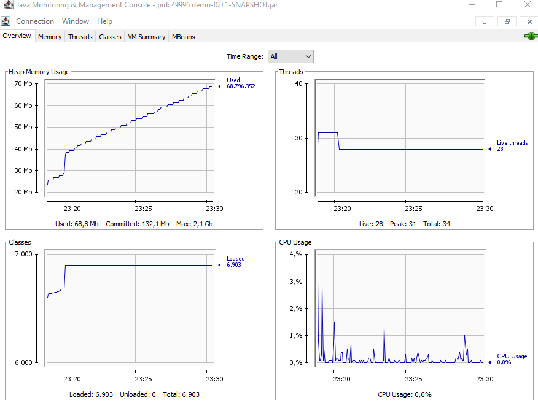
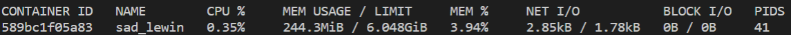

<p align="center">
    
</p>

# Openathon VIII QUARKUS - Spring Boot

## Introducción

Ahora vamos a por el contendiente, en la esquina derecha, no hace falta presentación: el actual campeón ¡¡¡Spring!!!. Todos nosotros hemos oido hablar de Spring y hoy por hoy es el principal recurso para implementar microservicios con java. Vamos por tanto a crear un proyecto similar al que ya hemos trabajado con Quarkus para poder comparar si efectivamente existe ganancia utilizando uno u otro. 

Vamos a ir rápido, lo importante es tener la aplicación funcionando cuanto antes. Si alguno de vosotros tiene interés en desarrollarlo, aquí tenéis los materiales del primer [Openathon](https://github.com/deors/deors-demos-microservices), donde lo desarrollamos con más profundidad.

## Creamos la aplicación

- Descargamos un proyecto básico desde [Spring Initializr](https://start.spring.io/). Seleccionamos “Maven Project” en “Project”, añadimos la dependencia “Spring Web” y pulsamos “GENERATE” sin modificar nada más. Obtendremos la estructura de un proyecto con lo necesario para ejecutarlo.

- Abrimos el proyecto con nuestro IDE y lo modificamos para añadirle el controlador necesario para responder las peticiones HTTP. Para ello creamos la clase GreetingControler.

```java
package com.example.demo;

import org.springframework.web.bind.annotation.GetMapping;
import org.springframework.web.bind.annotation.RestController;

@RestController
public class GreetingController {

	@GetMapping("/helloOpenathonS")
	public String greeting() {
		return "Hola Openathon";
	}
}
```

- Modificamos el pom para añadir dependencias.

```xml
<dependency>
	<groupId>ch.qos.logback</groupId>
	<artifactId>logback-core</artifactId>
	<version>1.2.3</version>
</dependency>
```

- Compilamos
```console
mvnw compile
```

- Comprobamos que la aplicación funciona correctamente.
```console
mvnw spring-boot:run
```

Tenemos que tener cuidado de hacerlo cuando no esté cargado el contenedor de Quarkus puesto que si no lógicamente el puerto 8080 estará ocupado. También podemos cambiar el puerto por defecto, incorporando en el fichero application.properties de la aplicación:

~~~
server.port=8081
~~~

- Podemos comprobar que funciona:
```console
curl -w "\n" http://localhost:8080/helloOpenathonS
```


## Empaquetando y ejecutando la aplicación


Vamos ahora a empaquetar la aplicación para poder ejecutarla de manera stand-alone.

- Empaquetamos la aplicación para poder ejecutarla de manera independiente:
```console
mvnw clean package
```

- Podríamos activar la aplicación ahora usando:
```console
java -jar target/demo-0.0.1-SNAPSHOT.jar
```

- Y ejecutarla de la misma manera 
```console
curl -w "\n" http://localhost:8080/helloOpenathonS
```


Podemos consultar en los logs el tiempo de arranque de la aplicación. Podemos también monitorizar el consumo de recursos utilizando jconsole. 



Podemos extraer:
  - Arranque: unos 9 segundos (3 segundos en el caso de Quarkus).
  - El consumo de memoria arranca en torno a las 26 megas (en el caso de Quarkus 20 megas).
  - Carga en torno a las 6900 clases (contra 4500)
  - Consume en arranque en torno al 3% del procesador y en torno al 0,1% en ejecución.

## Dockerizando la aplicación

- Añadimos el dockerfile en la raíz del proyecto.

FROM openjdk:11.0-jre
COPY target/*.jar /app.jar
ENTRYPOINT ["java","-jar","/app.jar"]


- Podemos crear ahora la imagen de docker
```console
docker build -t openathon/spring .
```

Podemos comprobar que se ha creado correctamente si listamos las images:
```console
docker images
```

Lo que debería devolvernos una lista de imágenes disponibles entre la que debería estar la que acabamos de crear:
```console
REPOSITORY                                   TAG             IMAGE ID       CREATED             SIZE
openathon/spring                            latest          9a80de0ce394   About an hour ago   318MB
```

Comprobamos que la nueva imagen ocupa 318MB.

- Lanzar la imagen al contenedor.
```console
docker run -p 8081:8081 openathon/spring
```
Comprobamos el tiempo de arranque de la aplicación, que en este caso son 8 segundos.
```console
2021-02-20 22:47:11.634  INFO 1 --- [           main] com.example.demo.DemoApplication         : Started DemoApplication in 8.172 seconds (JVM running for 9.726)
```

- Una vez arrancado podemos monitorizar el contenedor con:
```console
docker stats
```

Que nos devuelve:



# Conclusiones

Vamos a los datos que hemos ido sacando. 

- Datos en bruto:
  - Ejecución en JVM:

  | Instrucción | Quarkus | Spring Boot |
  | ------------- | ------------- | ------------- |
  | Tiempo de arranque | 3 sg | 9 sg |
  | Uso de Memoria | 20 megas | 30 megas |
  | Clases en memoria | 4500 | 6900 |
  | Procesador | 3% - 0,1% | 3% - 0,1% |
 
		
  - Ejecución containerizada:	

  | Instrucción | Quarkus JVM | Quarkus Native | Spring Boot |
  | ------------- | ------------- | ------------- |
  | Tiempo de arranque | 1,8 sg | 0,072 sg | 8 sg |
  | Uso de Memoria | 131 megas | 21 megas | 244 megas |
  | Procesador | 0,24% | 0,01% | 0,35% |	  

		
Es posible que vuestros datos no sean idénticos, pero si deberían reflejar una conclusión parecida sobre la mejora que supone Quarkus de manera general en todos los indicadores de consumo que hemos medido y lo espectacular que es en el caso de utilizar native images.		


[<Lab 03](../lab-03) 

<p align="center">
    
</p>